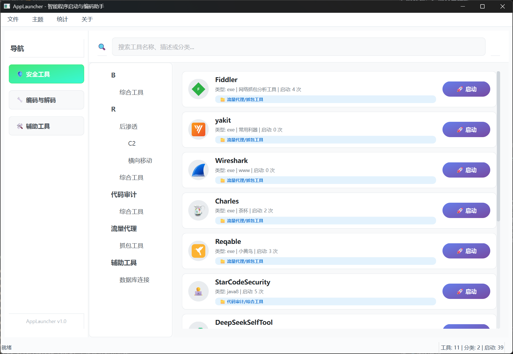
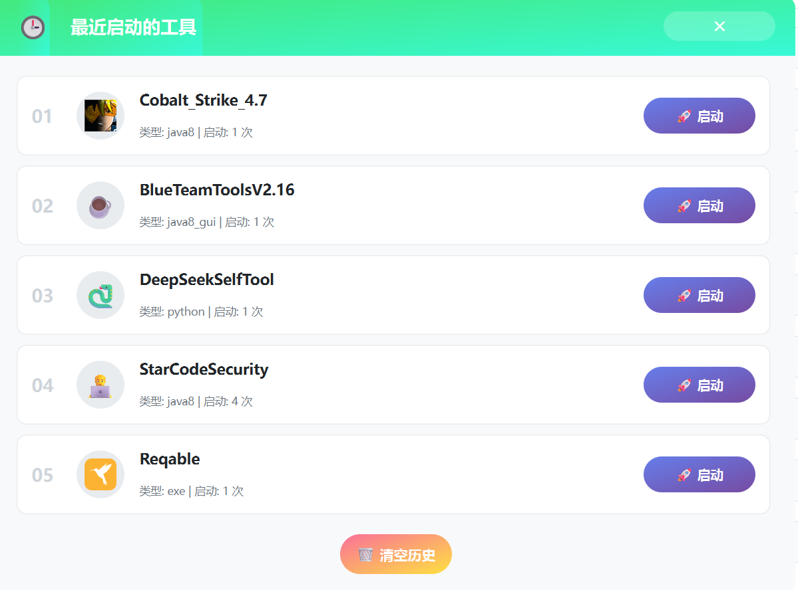

# SecuHub - 智能程序启动与编码助手 🚀

[](https://www.python.org/)
[](./LICENSE)
[](https://github.com/z50n6/app-launcher)

> 一站式本地工具管理、分类、启动与辅助脚本平台，专为安全工程师、开发者和极客设计。

---

## ✨ 项目亮点

- **极致美观**：现代化多主题 UI，无边框、可拖拽窗口，支持深色/浅色/自定义主题
- **无限分级**：树形大纲，支持多层级工具分类，结构一目了然
- **多类型兼容**：支持 EXE、命令行、Java、Python、PowerShell、网页、文件夹等多种工具
- **智能启动**：自动设置工作目录，支持参数传递，历史参数记忆
- **集成辅助**：内置 CyberChef、反弹 Shell 生成、Java 命令编码等实用工具
- **数据统计**：可视化统计面板、最近使用历史、启动次数排行
- **高效操作**：即时搜索、丰富快捷键、配置导入导出、右键菜单
- **状态栏提示**：底部状态栏实时显示操作提示、进度、错误信息、当前用户等
- **多语言支持**：支持中文、英文界面切换（开发中）
- **安全与隐私**：本地运行，数据不上传云端，支持配置加密（可选）

---

## 🚦 功能总览

| 功能模块     | 说明                                                         |
| ------------ | ------------------------------------------------------------ |
| 工具管理     | 添加/编辑/删除工具，支持多级分类，批量导入导出               |
| 智能启动     | 自动识别类型，设置工作目录，参数记忆，支持命令行/脚本/网页等 |
| 辅助功能     | CyberChef、反弹Shell生成、Java命令编码、常用脚本模板         |
| 统计面板     | 工具总数、启动排行、最近使用、可视化图表                     |
| 搜索与快捷键 | 全局搜索、常用操作快捷键、右键菜单                           |
| 状态栏提示   | 实时显示操作状态、错误、进度、用户信息                       |
| 主题切换     | 多主题一键切换，支持自定义                                   |
| 配置管理     | 配置导入导出、手动编辑、自动备份                             |

---

## 🚀 快速上手

### 环境要求
- **操作系统**：Windows 10/11
- **Python**：3.8 及以上
- **依赖库**：详见 requirements.txt

### 安装与启动

```bash
git clone https://github.com/z50n6/app-launcher.git
cd app-launcher
pip install -r requirements.txt
python launcher.py
```
或直接双击 `启动器.bat` 一键启动。

> **常见问题**：如遇依赖安装失败，请检查 Python 版本及网络环境，或手动安装缺失库。

---

## 🖼️ 界面预览

主界面（多主题支持，极简美观）  


统计面板（工具总数、启动排行、可视化图表）  


最近启动（历史记录一目了然）  


> **状态栏示例**：
> - 操作提示："已成功添加新工具：Nmap"
> - 进度显示："正在导入配置..."
> - 错误信息："启动失败，请检查路径或参数"
> - 当前用户："当前用户：admin"

---

## 📖 使用指南

- **添加工具**：主界面空白处右键，或菜单栏"文件"→"添加工具"
- **多级分类**：分类字段用 `/` 分隔，如 `红队/后渗透/C2`
- **切换主题**：菜单栏"主题"一键切换，支持深色/浅色/自定义
- **统计面板**：菜单栏"统计"→"总工具数"/"最近启动的工具"/"启动排行"
- **配置导入导出**：菜单栏"文件"→"导入/导出配置"，支持 JSON 格式
- **状态栏提示**：底部实时显示操作状态、错误、进度、用户信息
- **快捷键**：如 Ctrl+F 搜索、Ctrl+N 新建工具、Ctrl+S 保存配置等
- **辅助功能**：菜单栏"工具"→"CyberChef"/"反弹Shell生成"/"Java命令编码"

---

## ❓ 常见问题

- **Q: 可以手动编辑 config.json 吗？**  
  A: 可以，建议备份后编辑，重启程序生效。

- **Q: Java 工具如何正确启动？**  
  A: 工具类型选 `java8` 或 `java11`，参数栏填写完整命令参数，程序会自动设置工作目录。

- **Q: 状态栏提示内容可以自定义吗？**  
  A: 支持部分自定义，后续版本将开放更多自定义项。

- **Q: 数据是否会上传云端？**  
  A: 所有数据本地存储，绝不上传云端，保障隐私安全。

---

## 📄 开源协议

本项目基于 [MIT License](./LICENSE) 开源。

## 🙏 致谢

- [PyQt6](https://www.riverbankcomputing.com/software/pyqt/)
- [CyberChef](https://github.com/gchq/CyberChef)
- [revshells.com](https://www.revshells.com/)

---

> 欢迎 Star、Fork、提 Issue 交流改进！  
> **你的支持是我们持续优化的最大动力！**