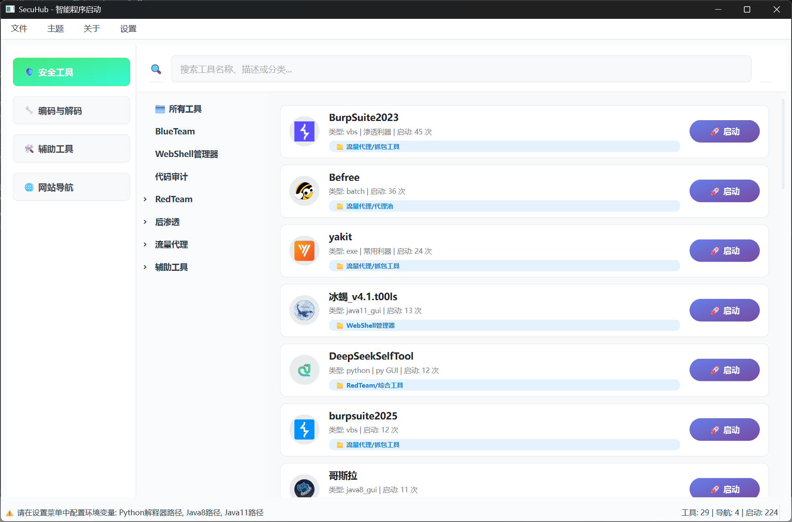
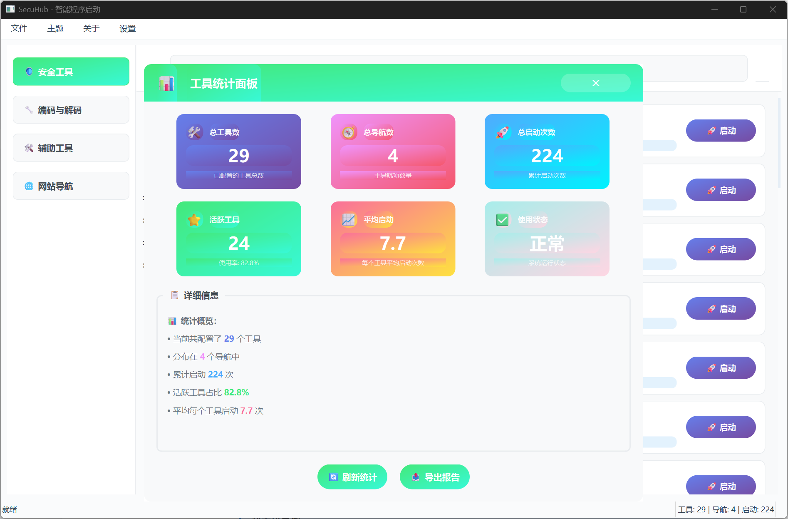
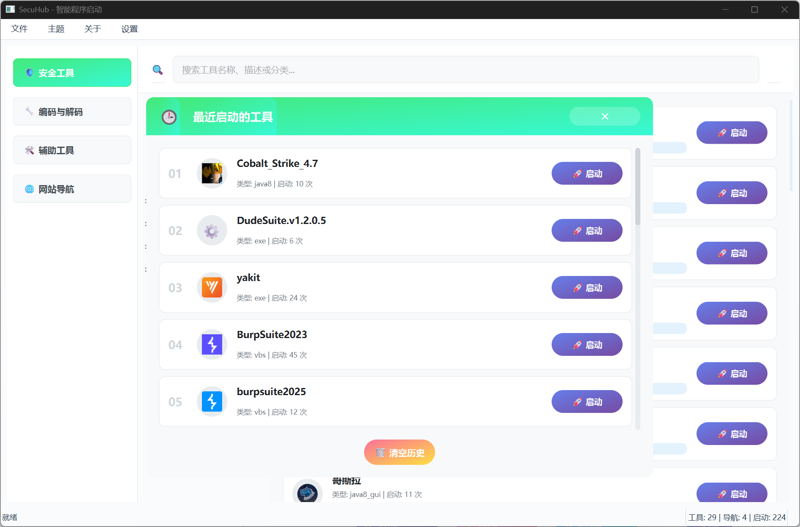

# SecuHub - 智能程序启动与编码助手 🚀

[](https://www.python.org/)
[](./LICENSE)
[](https://github.com/z50n6/app-launcher)

> 一站式本地工具管理、分类、启动与辅助脚本平台，专为安全工程师、开发者和极客设计。

---

## 目录

- [项目简介](#项目简介)
- [项目亮点](#项目亮点)
- [功能总览](#功能总览)
- [快速上手](#快速上手)
- [详细使用指南](#详细使用指南)
- [配置文件说明](#配置文件说明)
- [常见问题](#常见问题)
- [开发与贡献](#开发与贡献)
- [开源协议](#开源协议)
- [致谢](#致谢)

---

## 项目简介

SecuHub 是一款面向安全工程师、开发者和极客的本地工具管理平台，集成了工具分类、智能启动、辅助脚本、数据统计等多种实用功能，助你高效管理和使用各类本地工具。

---

## 项目亮点

- **极致美观**：现代化多主题 UI，支持深色/浅色/自定义主题
- **无限分级**：树形大纲，支持多层级工具分类
- **多类型兼容**：支持 EXE、命令行、Java、Python、PowerShell、网页、文件夹等
- **智能启动**：自动设置工作目录，支持参数传递与历史记忆
- **集成辅助**：内置 CyberChef、反弹 Shell 生成、Java 命令编码等
- **数据统计**：可视化统计面板、最近使用历史、启动次数排行
- **高效操作**：即时搜索、快捷键、配置导入导出、右键菜单
- **状态栏提示**：实时显示操作提示、进度、错误信息、当前用户等
- **多语言支持**：支持中英文界面切换（开发中）
- **安全与隐私**：本地运行，数据不上传云端，支持配置加密（可选）

---

## 功能总览

| 功能模块     | 说明                                                         |
| ------------ | ------------------------------------------------------------ |
| 工具管理     | 添加/编辑/删除工具，支持多级分类，批量导入导出               |
| 智能启动     | 自动识别类型，设置工作目录，参数记忆，支持命令行/脚本/网页等 |
| 辅助功能     | CyberChef、反弹Shell生成、Java命令编码、常用脚本模板         |
| 统计面板     | 工具总数、启动排行、最近使用、可视化图表                     |
| 搜索与快捷键 | 全局搜索、常用操作快捷键、右键菜单                           |
| 状态栏提示   | 实时显示操作状态、错误、进度、用户信息                       |
| 主题切换     | 多主题一键切换，支持自定义                                   |
| 配置管理     | 配置导入导出、手动编辑、自动备份                             |

---

## 快速上手

### 环境要求
- **操作系统**：Windows 10/11
- **Python**：3.8 及以上
- **依赖库**：详见 requirements.txt

### 安装与启动

```bash
git clone https://github.com/z50n6/app-launcher.git
cd app-launcher
pip install -r requirements.txt
python launcher.py
```
或直接双击 `启动器.bat` 一键启动。

> **常见问题**：如遇依赖安装失败，请检查 Python 版本及网络环境，或手动安装缺失库。

---

## 详细使用指南

### 1. 添加工具
- 右键主界面空白处，或菜单栏“文件”→“添加工具”
- 填写工具名称、类型（如 exe、python、java、web）、路径、参数、分类等信息
- 分类字段支持多级，用 `/` 分隔，如 `红队/后渗透/C2`
- 支持批量导入导出工具配置（JSON 格式）

### 2. 启动工具
- 双击工具即可启动，自动识别类型并设置工作目录
- 支持参数传递，历史参数自动记忆
- 可通过右键菜单快速复制命令、打开目录等

### 3. 辅助功能
- 菜单栏“工具”→“CyberChef”：内置强大数据处理工具
- “反弹Shell生成”：一键生成常用反弹 shell 命令
- “Java命令编码”：快速编码/解码 Java 命令

### 4. 统计面板
- 菜单栏“统计”→“总工具数”、“最近启动的工具”、“启动排行”
- 可视化图表展示工具使用频率、历史记录等

### 5. 主题切换
- 菜单栏“主题”一键切换多种主题
- 支持自定义主题（编辑 themes 目录下 .qss 文件）

### 6. 配置管理
- 菜单栏“文件”→“导入/导出配置”
- 支持手动编辑 config.json，建议备份后操作，重启程序生效
- 自动备份配置，防止数据丢失

### 7. 快捷键
- Ctrl+F：全局搜索
- Ctrl+N：新建工具
- Ctrl+S：保存配置
- 更多快捷键详见菜单栏提示

### 8. 状态栏提示
- 底部状态栏实时显示操作状态、错误、进度、当前用户等信息
- 便于追踪操作历史和排查问题

---

## 🖼️ 界面预览

主界面（多主题支持，极简美观）  


统计面板（工具总数、启动排行、可视化图表）  


最近启动（历史记录一目了然）  


> **状态栏示例**：
> - 操作提示："已成功添加新工具：Nmap"
> - 进度显示："正在导入配置..."

---

## 配置文件说明

### config.json
- 存储所有工具、分类、启动参数等信息
- 支持手动编辑，建议使用 JSON 编辑器，避免格式错误
- 主要字段说明：
  - `tools`：工具列表，包含名称、类型、路径、参数、分类等
  - `categories`：分类结构
  - `settings`：主题、语言、界面等个性化设置

### 其他数据文件
- `data/` 目录下存放内置工具、图标、辅助功能相关数据
- `logs/` 目录下为运行日志，便于排查问题

---

## 常见问题

- **Q: 可以手动编辑 config.json 吗？**  
  A: 可以，建议备份后编辑，重启程序生效。

- **Q: Java 工具如何正确启动？**  
  A: 工具类型选 `java8` 或 `java11`，参数栏填写完整命令参数，程序会自动设置工作目录。

- **Q: 状态栏提示内容可以自定义吗？**  
  A: 支持部分自定义，后续版本将开放更多自定义项。

- **Q: 数据是否会上传云端？**  
  A: 所有数据本地存储，绝不上传云端，保障隐私安全。

- **Q: 如何自定义主题？**  
  A: 编辑 themes 目录下的 .qss 文件，重启程序生效。

- **Q: 支持哪些工具类型？**  
  A: 支持 exe、bat、cmd、python、java、powershell、web、文件夹等。

---

## 开发与贡献

欢迎参与开发和贡献代码！

1. Fork 本仓库并克隆到本地
2. 新建分支进行开发
3. 提交 PR 并详细描述修改内容
4. 代码合并后会在下个版本发布

如有建议或 bug，欢迎提 Issue 交流。

---

## 📄 开源协议

本项目基于 [MIT License](./LICENSE) 开源，欢迎自由使用和二次开发。

---

## 🙏 致谢

- [PyQt6](https://www.riverbankcomputing.com/software/pyqt/)
- [CyberChef](https://github.com/gchq/CyberChef)
- [revshells.com](https://www.revshells.com/)

---

> 欢迎 Star、Fork、提 Issue 交流改进！  
> **你的支持是我持续优化的最大动力！**