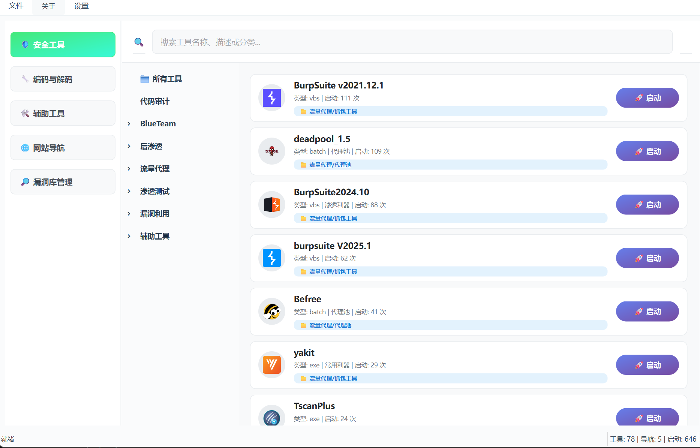
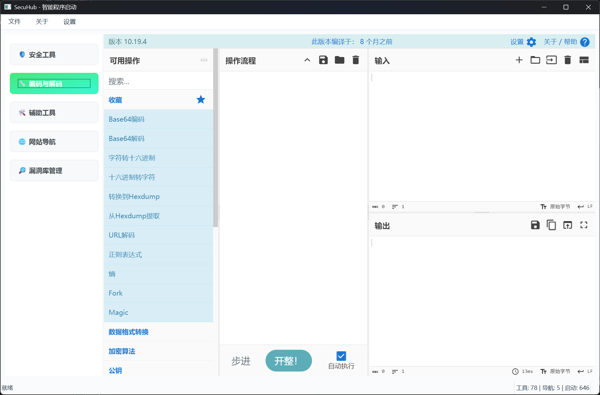
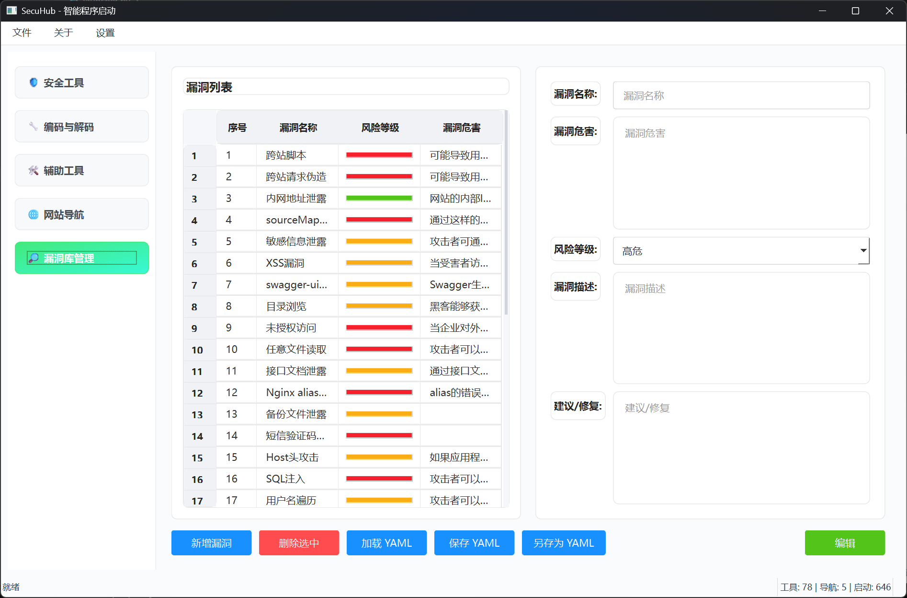

# SecuHub 🛡️ - 智能安全工具管理平台

[](https://www.python.org/)
[](https://www.riverbankcomputing.com/software/pyqt/)
[](./LICENSE)
[](https://github.com/z50n6/app-launcher)

## 🌟 项目简介

SecuHub 是一款专为安全工程师、开发者和极客打造的智能本地工具管理平台，旨在提供极致的工具管理、启动和辅助工作体验。




内嵌cyberchef




新增：

> 辅助编写渗透测试报告，快速复制



## ✨ 核心特性

### 🔧 智能工具管理
- **多层级分类**：树形大纲，支持无限层级工具组织
- **多类型兼容**：完美支持 EXE、命令行、Java、Python、PowerShell、网页、文件夹等
- **智能启动机制**：自动识别工作目录，支持参数传递与历史记忆

### 🚀 效率提升工具
- **CyberChef集成**：内置强大的数据处理工具
- **反弹Shell生成**：一键生成常用反弹 shell 命令
- **Java命令编码**：快速编码/解码 Java 命令
- **IP提取工具**：快速从文本中提取IP地址

### 📊 智能统计
- **启动排行**：追踪工具使用频率
- **最近使用**：快速访问最近启动的工具
- **可视化面板**：直观展示工具使用情况

## 🛠 快速开始

### 环境要求
- **操作系统**：Windows 10/11
- **Python**：3.8 及以上
- **依赖**：详见 `requirements.txt`

### 安装步骤

1. 克隆仓库 (Clone Repository):
```bash
git clone https://github.com/z50n6/app-launcher.git
cd app-launcher
```

2. 创建虚拟环境（可选但推荐）:
```bash
python -m venv venv
# Windows
venv\Scripts\activate
# Linux/macOS
source venv/bin/activate
```

3. 安装依赖 (Install Dependencies):
```bash
pip install -r requirements.txt
```

4. 启动应用 (Launch Application):
```bash
python launcher.py
```

> 💡 **提示**：也可直接双击 `启动器.bat` 一键启动。

## 🎮 详细使用指南 

### 1. 添加工具
- 右键主界面 → "添加工具"
- 支持多级分类，如 `红队/后渗透/C2`
- 支持批量导入/导出工具配置

### 2. 工具启动
- 双击工具自动启动
- 支持参数传递
- 历史参数自动记忆

### 3. 辅助功能
- **CyberChef**：强大的数据处理工具
- **反弹Shell生成**：一键生成常用反弹 shell 命令
- **Java命令编码**：快速编码/解码 Java 命令
- **IP提取**：从文本中快速提取IP地址

## 🔍 常见问题 (FAQ)

<details>
<summary>📌 点击展开常见问题</summary>

- **Q: 可以手动编辑 config.json 吗？**  
  A: 可以，建议备份后编辑，重启程序生效。

- **Q: 支持哪些工具类型？**  
  A: 支持 exe、bat、cmd、python、java、powershell、web、文件夹等。

- **Q: 数据是否会上传云端？**  
  A: 所有数据本地存储，绝不上传云端，保障隐私安全。

- **Q: 如何自定义主题？**  
  A: 编辑 `themes` 目录下的 `.qss` 文件，重启程序生效。
  </details>


## 📦 项目结构

```
SecuHub/
├── config.json         # 工具配置文件
├── launcher.py         # 主启动脚本
├── requirements.txt    # 依赖列表
├── modules/            # 核心模块
│   ├── config_manager.py
│   ├── tool_card.py
│   └── ...
├── project/            # 内置项目
│   ├── CyberChef/
│   ├── reverse-shell/
│   └── ...
└── themes/             # 主题样式文件
```

## 🙏 致谢

感谢以下项目和工具的支持：
- [PyQt6](https://www.riverbankcomputing.com/software/pyqt/)
- [CyberChef](https://github.com/gchq/CyberChef)
- [revshells.com](https://www.revshells.com/)

---

> 🌟 **你的 Star 是我持续优化的最大动力！** 
> 欢迎提出 Issues、提交 Pull Requests 或分享使用体验！

## 📝 许可证

本项目采用 MIT 许可证 - 详见 [LICENSE](./LICENSE) 文件。